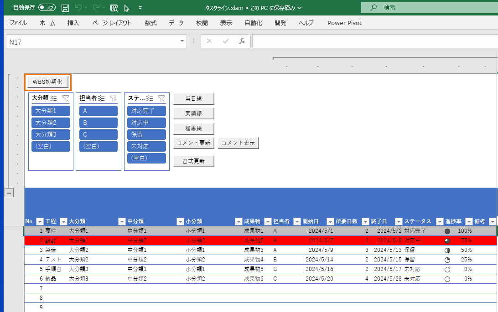
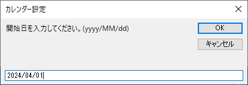
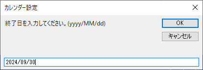
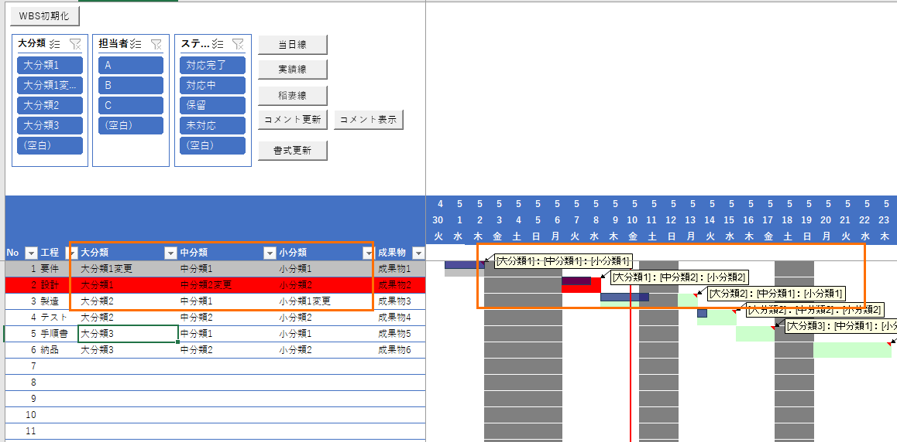
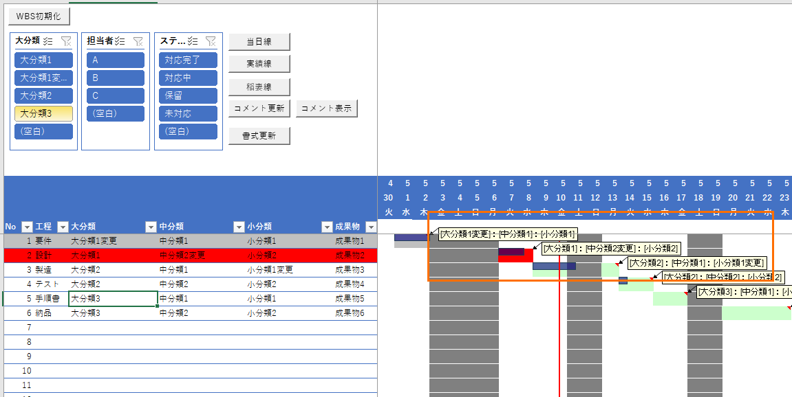
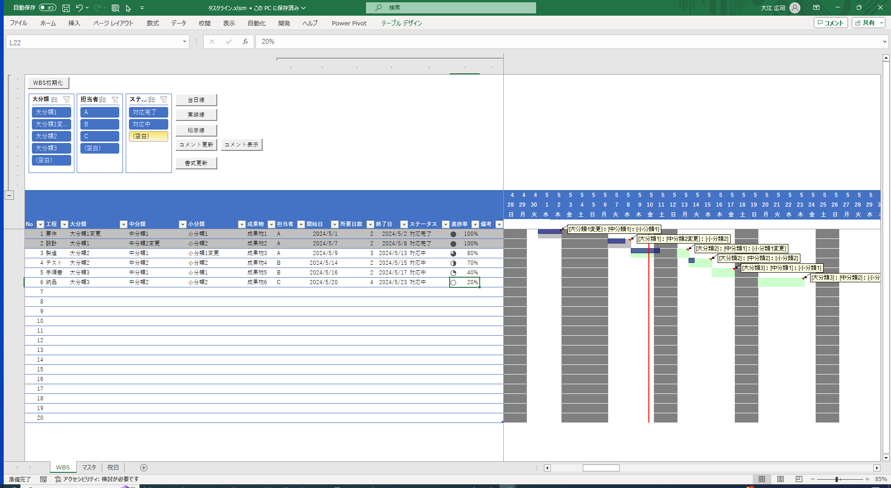
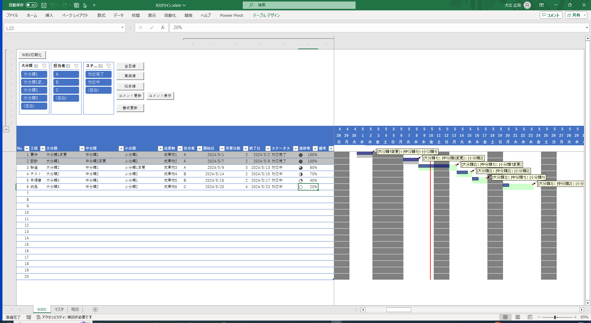
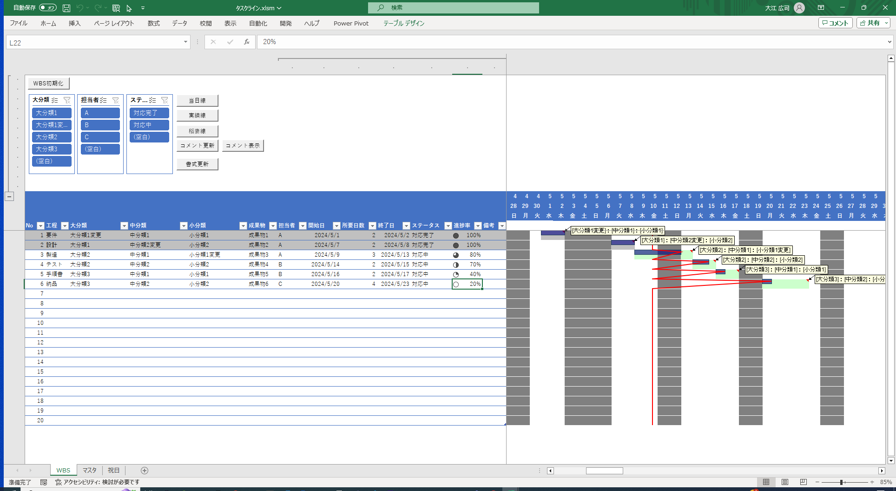

<!-- omit in toc -->
# タスクライン

タスクラインツールの利用方法について記載する。

- [1. 機能](#1-機能)
- [2. 操作例](#2-操作例)
  - [2.1. WBS初期化](#21-wbs初期化)
  - [2.2. タスクの変更](#22-タスクの変更)
  - [2.3. 進捗の更新](#23-進捗の更新)
- [3. 使用時の注意事項](#3-使用時の注意事項)

## 1. 機能

Excel VBA、テーブル、スライサー、条件付き書式を活用して作成されており、以下の機能を有する。

- テーブルによるタスク管理
  - 開始日・所要日数から営業日を考慮した終了日算出。
- スライサーによるフィルター
- ステータスに応じたハイライト
- ガントチャート描画
  - 期間指定によるカレンダー生成
  - 当日線の描画
  - 進捗率に応じた実績線の描画
  - 稲妻線の描画
  - ガントチャート内コメント表示

## 2. 操作例

### 2.1. WBS初期化

プロジェクトの期間に応じて、カレンダーを生成することができる。

1. `WBS初期化`ボタンを押下。  
   
2. プロジェクトの開始日を入力。  
   
3. プロジェクトの終了日を入力。  
   

指定した日付範囲でカレンダーが生成されます。  
また、運用開始後に同操作をすることでカレンダー範囲を変更することも可能です。

### 2.2. タスクの変更

タスク(大,中,小分類)を追加・修正した際は、`コメント更新`を押下することでガントチャート内のコメントに反映できる。  

1. タスクを修正。  
   
2. `コメント更新`ボタンを押下。  
   

### 2.3. 進捗の更新

進捗更新時には`実績線`ボタン、`稲妻線`ボタンを押下することで進捗率をガントチャートに反映、可視化することができる。

1. 進捗率を更新。  
   
2. `実績線`ボタンを押下。  
   
3. `稲妻線`ボタンを押下。  
   

## 3. 使用時の注意事項

利用時・カスタマイズ時は以下の点に注意してください。

- テーブルの編集
  - 以下の列はガントチャートを描画する上で必須の列となっているため、削除しないでください。(列名の変更は可能)
    - 大,中,小分類
    - 開始日
    - 終了日
    - ステータス
    - 進捗率
  - No列は欠落があると正常にガントチャートを描画できないため、最終行まで値を設定してください。
- 名前付き範囲
  - プログラムからセルを参照する際にセルに設定した名前付き範囲を使用しています。そのため、セルの名前定義は変更しないでください。
  - セル番地での参照ではないため列追加や行追加は適宜行って問題ありません。
- シート名
  - 各シート名,テーブル名は変更しないでください。
